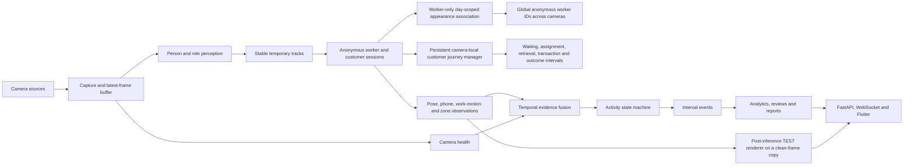

# Architecture

Status: **Implemented reference architecture**. Model accuracy and production reliability remain **unmeasured**.

Professional description: **Layered, event-driven computer-vision architecture with temporal evidence fusion and state-machine-based pharmacy operations analytics.**

The capture layer owns frames and health; detectors own observations; the tracker owns camera-local temporary IDs; session services own continuous anonymous appearances; the global identity service conservatively associates confirmed worker sessions across cameras; the activity engine alone selects official activity; the event service opens and closes non-overlapping intervals; analytics aggregates completed events. Flutter displays backend results and never calculates activities.

> The system does not classify employee performance from a single frame. It converts camera frames into detections, stable anonymous tracks, temporal evidence, reviewable activity events and aggregated operational analytics.

Unavailable cameras force presence and activity to `UNKNOWN`; unavailable time is excluded from worker totals. Worker sessions may be joined for one calendar day using encrypted, short-lived clothing/body descriptors with threshold, margin and active-camera conflict checks. Facial data is never used for matching, customers are never appearance-matched, and ambiguous worker sessions stay separate for manager review.
