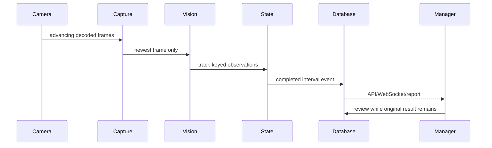

# Data flow

Status: capture-to-event flow is **implemented**; site-specific perception quality is **unmeasured**.

There is one bounded latest-frame slot per camera, so slow inference drops stale frames rather than accumulating delay.

